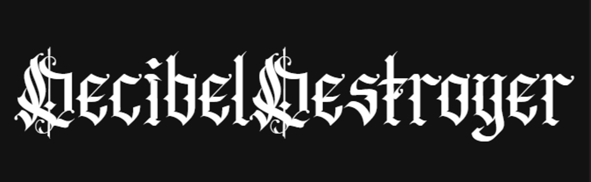

A content-based recommendation engine for heavy metal bands, forged in blood and code.

This engine utilizes TF-IDF text vectorization and cosine similarity ("blood pact similarity") on lyrical themes and genres to compute the "Trve" similarity score between a massive grimoire of legendary bands. 

## Features
- **Sonic Invocations:** Transforms text inputs (genres and themes) into an overlapping vector space.
- **Abyss Echoes:** Uses fuzzy string matching to retrieve the closest matching band if there are typos in the input query.
- **Trve Kvlt Scoring:** Outputs the top 5 most similar bands sorted by cosine similarity.

Provide the sacred texts in CSV format, and let the Decibel Destroyer summon your next favorite mosh pit neighbors.
